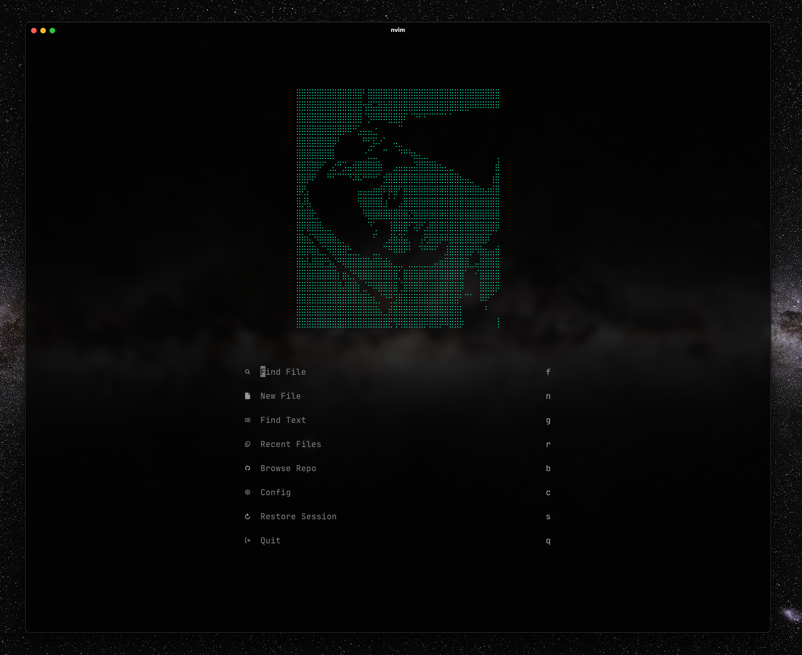
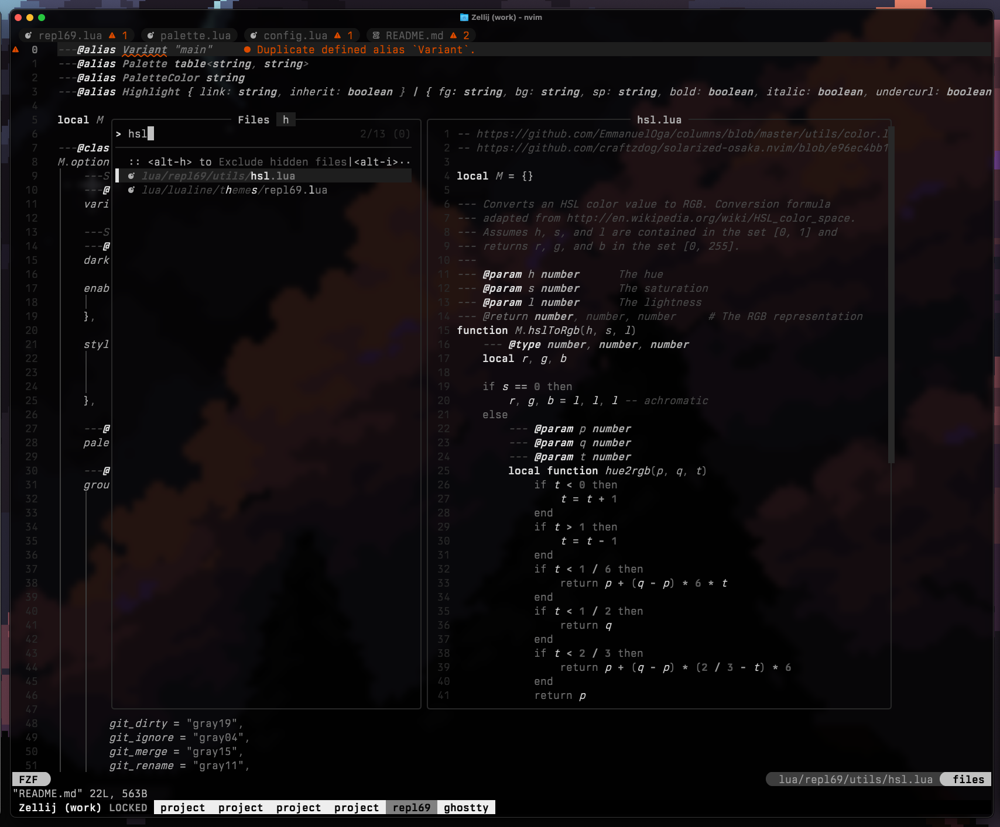
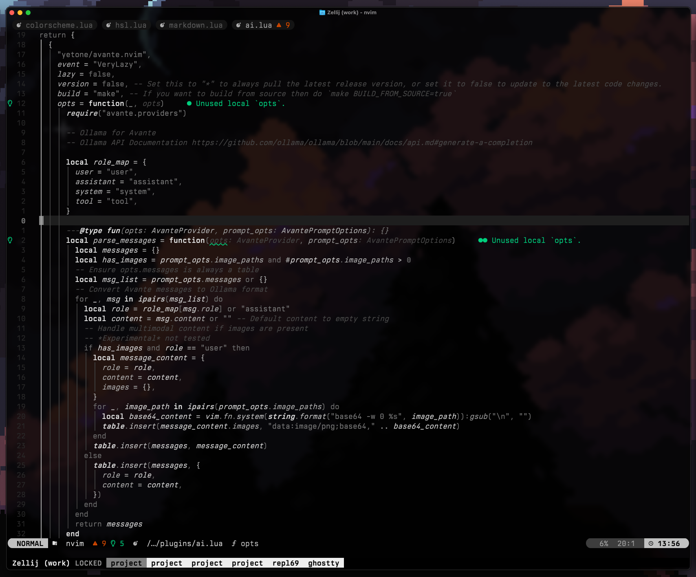
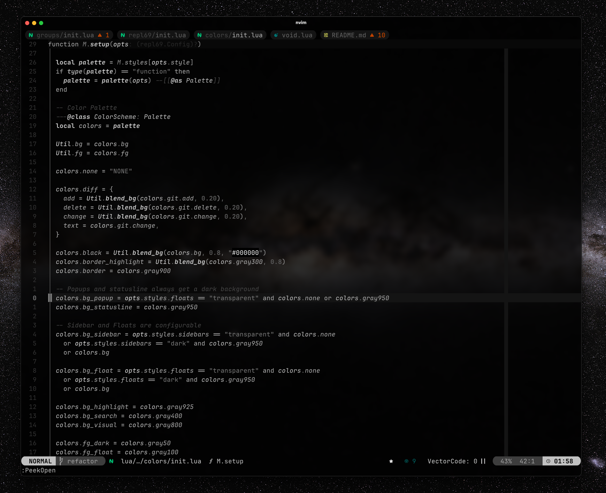

# repl69

Monochrome colorscheme with decent accents for neovim.

## Getting started

### [lazy.nvim](https://lazy.folke.io/installation)

```lua
-- lua/plugins/colorscheme.lua
return {
  {
    "repl6669/repl69",
    name = "repl69",
    lazy = false,
    priority = 1000,
  },

  {
    "LazyVim/LazyVim",
    opts = {
      colorscheme = "repl69",
    },
  }
}
```

## Screenshots






## Options

```lua
require("repl69").setup({
    enable = {
        -- Set terminal colors
        terminal = true,
    },

    -- Enabled styles
    styles = {
        bold = true,
        italic = true,
        transparency = true,
    },

    -- Custom highlight groups
    highlight_groups = {},
})

vim.cmd("colorscheme repl69")
```

## Credits

- Heavily based on [rose-pine](https://github.com/rose-pine/neovim) neovim theme.
- Inspired by [presto.vim](https://github.com/ewilazarus/preto/blob/master/colors/preto.vim).
