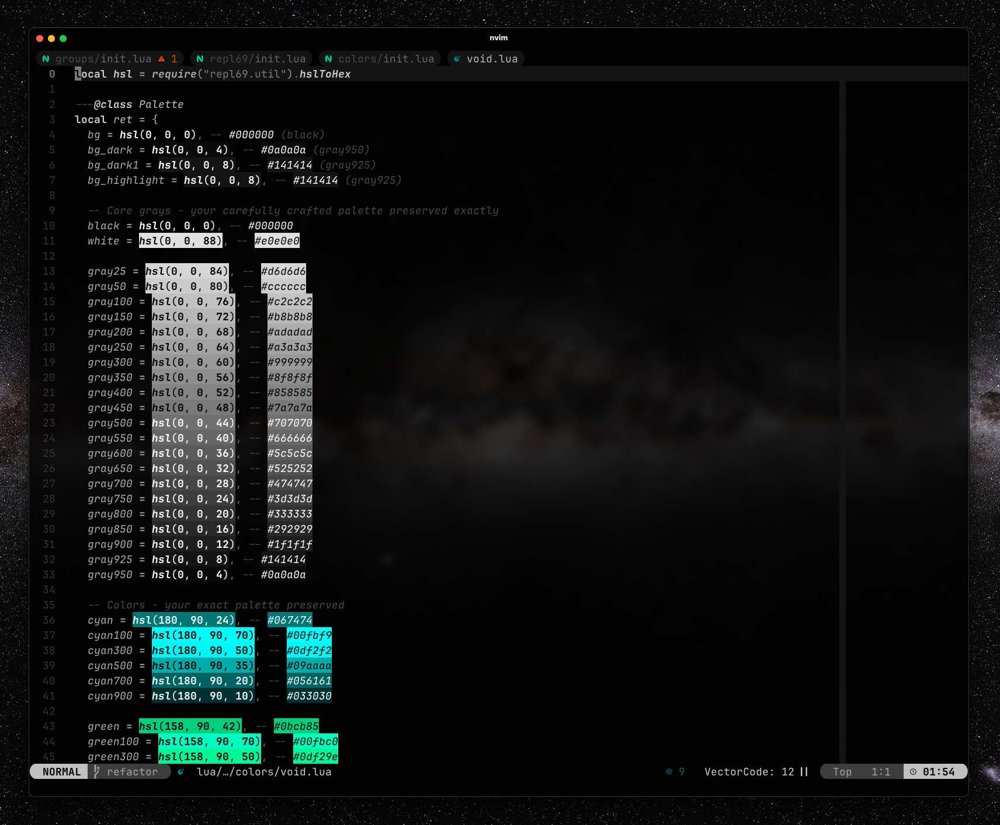
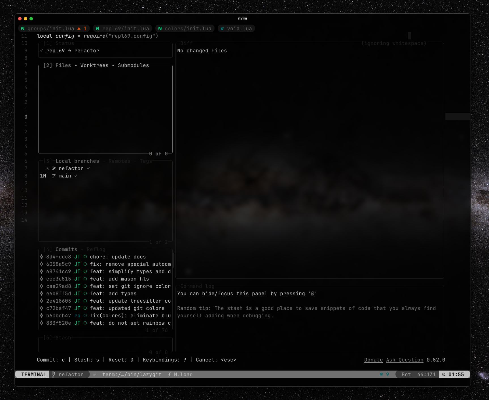

# repl69

Repl69 has evolved from a simple colorscheme into a powerful theming ecosystem that provides consistent, elegant styling across the entire Neovim plugin landscape. Built on a systematic grayscale foundation with strategic accent colors.

## ✨ Features

- 🎨 **Comprehensive Plugin Support**: 69+ popular plugins with dedicated highlight integration
- 🏗️ **Modular Architecture**: Clean, maintainable, and extensible design
- ⚡ **Performance Optimized**: On-demand loading with intelligent plugin detection
- 🎯 **Consistent Theming**: Unified visual language across all supported plugins
- 🔧 **Highly Configurable**: Granular control over plugin support and styling
- 📚 **Complete Documentation**: Extensive guides and references

### Basic Setup

```lua
require("repl69").setup()
vim.cmd("colorscheme repl69")
```

### With Plugin Support

```lua
require("repl69").setup({
  plugins = {
    auto = true,  -- Auto-detect and enable installed plugins
    -- Or enable all: all = true
    -- Or selective: telescope = true, cmp = true, etc.
  }
})
vim.cmd("colorscheme repl69")
```

## 🚀 Performance

## 🔧 Legacy Configuration (Pre-v2.0)

---

**Repl69**: From simple colorscheme to comprehensive theming ecosystem. Experience consistent, elegant styling across your entire Neovim workflow.

- **On-demand Loading**: Only loads highlights for detected/enabled plugins
- **Smart Detection**: Automatically discovers installed plugins with `auto = true`
- **Efficient Caching**: Compiled highlights cached for optimal performance
- **Minimal Impact**: Negligible effect on startup time
- **Memory Optimized**: Only necessary highlights kept in memory

### 🔌 Supported Plugin Categories

- **Completion & LSP**: nvim-cmp, blink.cmp, copilot, codeium, supermaven, semantic tokens
- **Development Tools**: dap, neotest, gitsigns, ale, mason, neogit, octo
- **Mini.nvim Ecosystem**: Complete support for 16 essential mini plugins
- **Modern Tools**: blink.cmp, aerial, copilot, render-markdown, headlines, grug-far, and more

**A comprehensive monochrome theming ecosystem for Neovim with 69+ plugin integrations.**
[**→ View complete plugin list**](docs/PLUGINS.md)

## Getting started

### [lazy.nvim](https://lazy.folke.io/installation)

For users upgrading from earlier versions:

```lua
-- lua/plugins/colorscheme.lua
return {
  {
    "repl6669/repl69",
    name = "repl69",
    lazy = false,
    priority = 1000,
  },

  {
    "LazyVim/LazyVim",
    opts = {
      colorscheme = "repl69",
    },
  }
}
```

## 🤝 Contributing

Contributions are welcome! The modular architecture makes adding new plugins straightforward:

1. Create `lua/repl69/groups/new_plugin.lua` following the template pattern
2. Add plugin mapping to `lua/repl69/groups/init.lua`
3. Test the integration with appropriate highlights
4. Update documentation

See [Architecture Guide](docs/ARCHITECTURE.md) for detailed contribution guidelines.

### Advanced Configuration

```lua
require("repl69").setup({
  -- Core settings
  transparent = false,
  terminal_colors = true,

  -- Styling options
  styles = {
    comments = { italic = true },
    keywords = { bold = true },
    functions = { bold = true },
    variables = { italic = true },
  },

  -- Plugin ecosystem
  plugins = {
    auto = true,  -- Recommended: auto-detect plugins

    -- Or configure selectively:
    -- Core editing
    telescope = true,
    cmp = true,
    treesitter = true,

    -- Modern tools
    blink = true,
    flash = true,
    aerial = true,

    -- Git integration
    gitsigns = true,

    -- UI enhancements
    alpha = true,
    noice = true,

    -- Mini.nvim ecosystem
    ['mini_statusline'] = true,
    ['mini_files'] = true,
    ['mini_cursorword'] = true,

    -- Development tools
    dap = true,
    neotest = true,
    copilot = true,
  },

  -- Customization hooks
  on_highlights = function(highlights, colors)
    -- Override specific highlights
    highlights.Comment = { fg = colors.gray600, italic = true }
  end,
})
```

## ⚡ Quick Setup

## Screenshots






## 📚 Documentation

- **[Plugin Guide](docs/PLUGIN_GUIDE.md)** - Complete guide to plugin ecosystem and configuration
- **[Plugin Reference](docs/PLUGINS.md)** - Detailed reference of all 69+ supported plugins
- **[Architecture Guide](docs/ARCHITECTURE.md)** - Technical architecture and extension patterns

## 🎯 Plugin Ecosystem Highlights

### 🔍 **Search & Navigation**

```lua
plugins = {
  telescope = true,    -- Fuzzy finder with custom styling
  flash = true,        -- Modern motion plugin
  aerial = true,       -- Code outline and symbols
}
```

### 💻 **Modern Completion**

```lua
plugins = {
  blink = true,        -- Next-gen completion engine
  cmp = true,          -- Traditional nvim-cmp
  copilot = true,      -- AI-powered suggestions
}
```

### ✨ **Mini.nvim Ecosystem**

Complete support for the mini.nvim plugin collection:

```lua
plugins = {
  ['mini_files'] = true,       -- File explorer
  ['mini_statusline'] = true,  -- Clean statusline
  ['mini_cursorword'] = true,  -- Highlight word under cursor
  ['mini_pick'] = true,        -- General picker
  ['mini_diff'] = true,        -- Git diff visualization
  -- ... and 8 more mini plugins
}
```

### 🛠️ **Development Tools**

```lua
plugins = {
  dap = true,          -- Debug Adapter Protocol
  neotest = true,      -- Test runner integration
  gitsigns = true,     -- Git integration
  ale = true,          -- Linting engine
}
```

## 🎨 Color Philosophy

Repl69 uses a systematic **20-step grayscale progression** for maximum readability and consistency:

- **Background Elements**: `black` → `gray900` (Deep backgrounds, sidebars)
- **UI Components**: `gray800` → `gray500` (Borders, guides, inactive elements)
- **Secondary Text**: `gray600` → `gray400` (Comments, metadata)
- **Primary Content**: `gray300` → `gray100` (Code, text, active elements)
- **Emphasis & Focus**: `gray200` → `white` (Keywords, functions, highlights)

**Semantic Accents** (used sparingly):

- 🔴 **Error**: `#ef4444` - Critical issues
- 🟡 **Warning**: `#f59e0b` - Warnings and modifications
- 🔵 **Info**: `#3b82f6` - Information and hints
- 🟢 **Success**: `#10b981` - Success and additions

```lua
-- Old configuration style (still supported)
require("repl69").setup({
  enable = {
    terminal = true,
  },
  styles = {
    bold = true,
    italic = true,
    transparency = true,
  },
  highlight_groups = {}, -- Use on_highlights instead
})
```

## 📊 Plugin Support Status

| Category                | Plugins Supported  | Coverage     |
| ----------------------- | ------------------ | ------------ |
| **Search & Navigation** | 6/8 major plugins  | 🟢 Excellent |
| **Completion & LSP**    | 6/6 major plugins  | 🟢 Complete  |
| **File Management**     | 3/4 major plugins  | 🟢 Excellent |
| **UI Enhancement**      | 8/10 major plugins | 🟢 Excellent |
| **Development Tools**   | 6/8 major plugins  | 🟢 Excellent |
| **Mini.nvim Ecosystem** | 16/21 mini plugins | 🟢 Excellent |
| **Status & Tablines**   | 4/5 major plugins  | 🟢 Excellent |

**Total**: 69+ plugins supported and growing!

## Credits

- **Original Inspiration**: [preto.vim](https://github.com/ewilazarus/preto/blob/master/colors/preto.vim)
- **Architecture Inspiration**: [tokyonight.nvim](https://github.com/folke/tokyonight.nvim) for modular design patterns
- **Community**: Contributors and users who provided feedback and plugin requests
